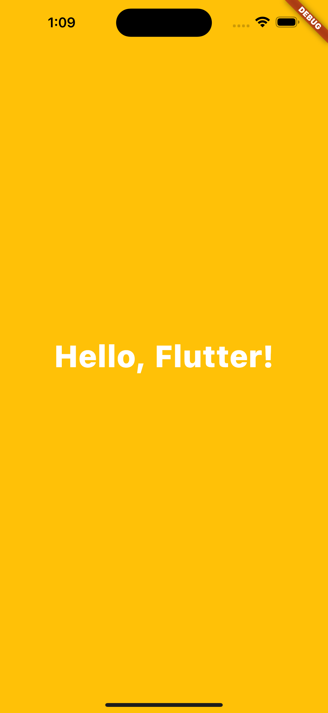
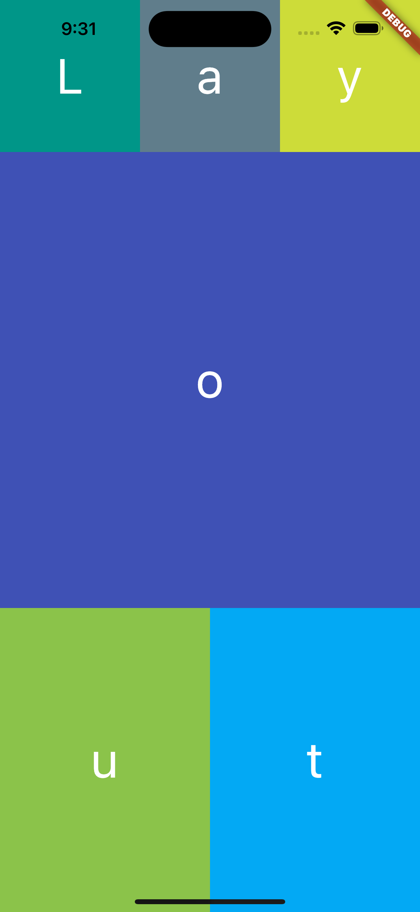

# Hello, Flutter!

### Contents
##### [1. Hello, Flutter!](#1-hello-flutter)
##### [2. Flutter Layout](#2-flutter-layout)

 

### 1. Hello, Flutter!

[View code](/lib/hello.dart)

 

### 2. Flutter Layout

[View code](/lib/layout.dart)