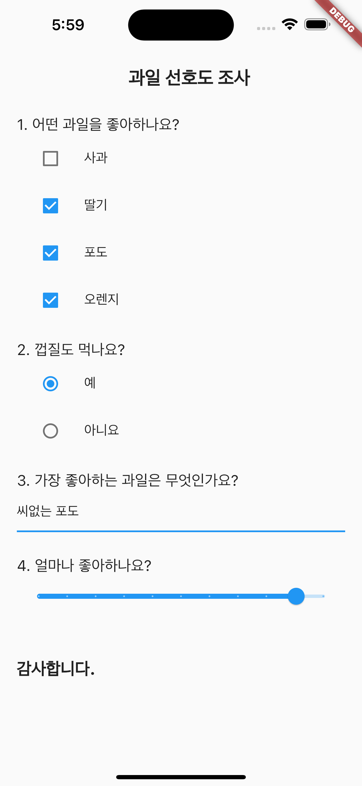

# Hello, Flutter!

### Contents
##### [1. Hello, Flutter!](#1-hello-flutter-1)
##### [2. Flutter Layout](#2-flutter-layout-1)
##### [3. User Input](#3-user-input-1)

 

### 1. Hello, Flutter!

[View code](/lib/hello.dart)

 

### 2. Flutter Layout

[View code](/lib/layout.dart)

 

### 3. User Input

[View code](/lib/input.dart)